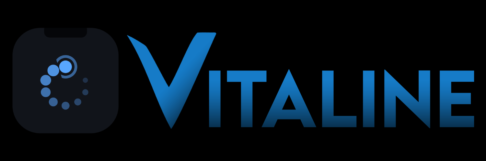
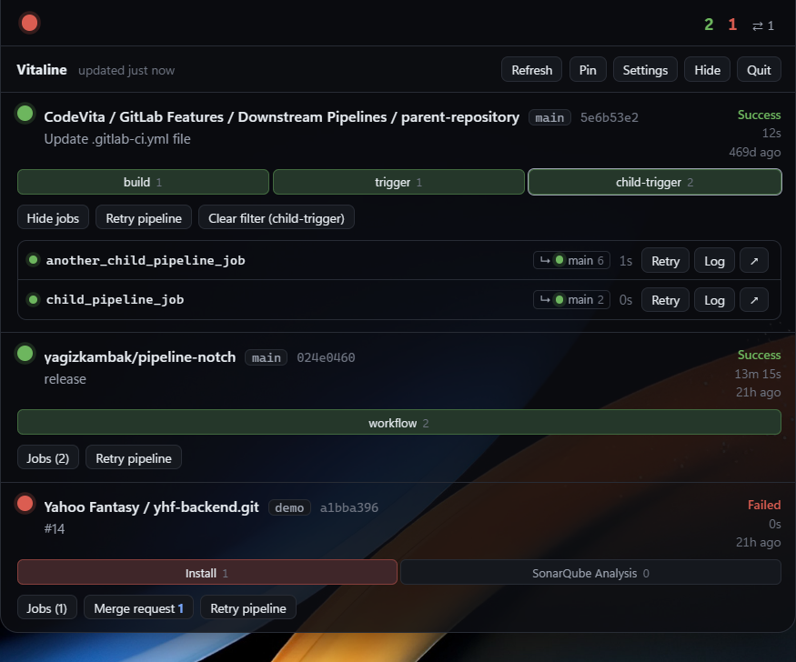
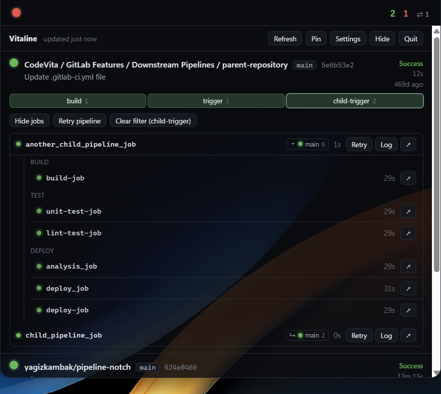
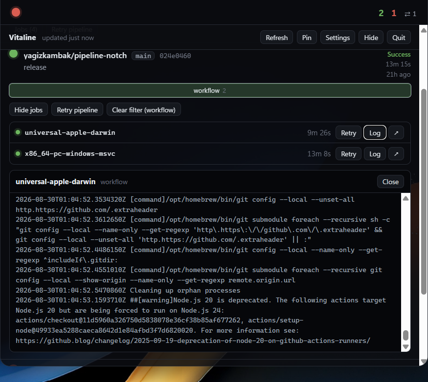
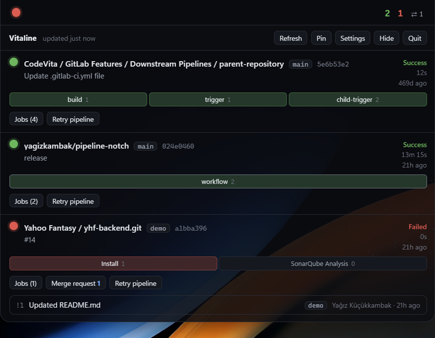

A desktop app that shows CI pipeline status as a notch-style HUD at the top
center of your screen — or as a **widget** you park anywhere and leave open.
Watches **GitLab, GitHub Actions, and Azure DevOps** at the same time; runs
from the same codebase on Windows and macOS.

Collapsed, the notch is just a pill: a colored status dot, project counters,
and the count of open merge requests. Hover over it and it opens downward,
showing each watched project's latest pipeline, its stage breakdown, its
jobs, and its open MRs; from there you can retry or cancel jobs, manually
start a job, and read the log tail of a failed job.

Prefer something that's simply always there? Switch to **widget mode** — the
same data as one line per project, in a movable, resizable panel that can
either float above your windows or sit behind them on the desktop. See
[Widget mode](#widget-mode).

When a **new merge request / PR opens** on a watched repo, you get a desktop
notification, and the same announcement scrolls as **ticker text** inside the
notch (click it to open in the browser). The MRs already open when the app
first launches are recorded silently — MRs opened months ago aren't
re-announced on every startup. A short announcement scrolls the same way when
a pipeline breaks or recovers.

## Provider support matrix

| | GitLab | GitHub Actions | Azure DevOps |
|---|---|---|---|
| Latest pipeline + stage/job | ✅ | ✅ (no stages → single "workflow" group) | ✅ (Timeline API) |
| Pipeline retry / cancel | ✅ | ✅ | ✅ |
| Job retry | ✅ | ✅ | ❌ |
| Job cancel / manual start | ✅ | ❌ | ❌ |
| Job log | ✅ | ✅ | ✅ |
| Open MR/PR + notification | ✅ | ✅ | ✅ |

Buttons the provider doesn't support never show up in the UI. Project id
formats — GitLab: `12345` or `group/project`; GitHub: `owner/repo`; Azure:
`Project` or `Project/DefinitionId` (the definition id is the `definitionId`
in the pipeline's URL).

```
        ┌──────────────┐
────────┤  ● 3 1 ✗ 1   ├────────    ← collapsed (opens on hover)
        └──────────────┘
```

## Widget mode

One surface is on screen at a time: the notch, or the widget. The widget is a
borderless panel that shows one line per watched project — status dot, the
stage that explains that status, a compact stage bar, how long ago the
pipeline ran, and the open-MR count. Click a line and it expands in place to
the same stage/job detail the notch panel has, with the same Retry / Cancel /
Start / Log buttons.

```
┌ ⠿ ● Vitaline        4m ago    ⟳ ⚙ ✕ ┐
│ ▸ ✓ web-app    build ▪▪▪▪  2d   ⇄ 2 │
│ ▾ ● api        test  ▪▪▫▫  1m 4s    │
│     ✓ lint             12s  Retry ↗ │
│     ● test:unit      1m 4s  Cancel  │
│     ▸ deploy        manual  Start   │
│ ▸ ✗ mobile     lint  ▪▫▫▫  5d       │
├─────────────────────────────────────┤
│ Notch mode                  Quit  ◢ │
└─────────────────────────────────────┘
```

**Switching**: the tray menu's **Widget mode** item, the **Widget** button in
the notch panel, **Notch mode** in the widget's footer, or Settings →
Display. All four write the same setting, so they stay in step with each
other.

**Moving and resizing**: drag the header to move it, the corner grip at the
bottom right to resize it. Position and size are remembered in `config.json`
(written 0.7s after you stop dragging, not on every frame). If the monitor a
widget was parked on is gone at the next launch, it's placed at the top right
of the primary screen instead of coming back off-screen.

**Layer** (Settings → Display):

- **Above other windows** — always visible, like the notch.
- **On the desktop, behind other windows** — never covers what you're working
  on; you see it when you see your desktop. This is `always_on_bottom`:
  NSWindow level −1 on macOS, `HWND_BOTTOM` on Windows. Not literally the
  wallpaper layer (desktop icons stay below it), but no app window ever ends
  up underneath it.

**Opacity** applies to the widget's background only — text and status colors
stay fully opaque, so a see-through widget is still readable.

Announcements (a new MR/PR, a pipeline that broke or recovered) show up as a
strip above the footer instead of the notch's scrolling ticker; clicking it
opens the MR in the browser. Desktop notifications are unaffected by the mode.

## Screenshots

Taken from my own day-to-day watch list, as example data.

| | |
|---|---|
|  |  |
|  |  |

## How it works

- **Rust (`src-tauri/`)** — All HTTP traffic happens here. The webview never
  sees the token, and there's no CORS to deal with. A poll loop runs in the
  background; the tray icon and notifications keep updating even while every
  window is hidden.
- **React (`src/`)** — Display only. Listens for the `pipelines://updated`
  event Rust publishes, sends actions back via `invoke`.
- **Three windows, one snapshot** — `notch`, `widget` and `settings` are
  separate webviews over the same Rust state; the snapshot event is broadcast
  to all of them. The notch and the widget are never on screen together
  (`displayMode`), but both stay loaded, which is what makes switching modes
  instant.
- **Window size** — The notch measures the panel's real height and reports it
  to Rust via `set_notch_size`; Rust resizes the window to that size and
  re-centers it at the top of the screen. Opening/closing works entirely
  through this one mechanism. The widget is the other way around: the user
  sizes the window and Rust records the result
  ([`src-tauri/src/widget.rs`](src-tauri/src/widget.rs)), while the panel
  simply fills whatever it's given.
- **Tokens** — Stored in the OS keychain (macOS Keychain, Windows Credential
  Manager). Falls back to a file in the config directory if the keychain
  isn't reachable.

## Setup

Requirements:

- Node.js 18+
- Rust toolchain (`rustup`)
- **Windows:** WebView2 Runtime (comes pre-installed on Windows 11) and the
  C++ component of Visual Studio Build Tools
- **macOS:** Xcode Command Line Tools (`xcode-select --install`)

If you don't have Rust:

```bash
winget install Rustlang.Rustup
```

On macOS/Linux:

```bash
curl --proto '=https' --tlsv1.2 -sSf https://sh.rustup.rs | sh
```

Then install dependencies:

```bash
npm install
```

## Running it

Dev mode (Vite + Tauri together):

```bash
npm run app
```

A distributable package (`.msi`/`.exe` on Windows, `.app`/`.dmg` on macOS):

```bash
npm run app:build
```

If you just want to run the web side, `npm run dev` — but `invoke` calls
don't work without Tauri, so the window shows up empty.

### Two gotchas when running it

**"Port 1420 is already in use"** — a vite server left over from a previous
run. Tauri doesn't always take the vite process it spawned down with it when
it closes:

```bash
npx kill-port 1420
```

**"failed to remove file ... vitaline.exe / Access is denied"** — the app is
still running, so cargo can't overwrite the binary. Click Quit from the tray
menu, or:

```bash
taskkill /IM vitaline.exe /F
```

## First-time setup

On first launch there's no watched project yet, so the Settings window opens
on its own. Enter tokens for the providers you'll use (each is stored
separately in the OS keychain), then add projects by picking a provider.

**Token scopes:**

- **GitLab** — Preferences → Access tokens. `read_api` to watch;
  `api` to retry/cancel/start. With only `read_api`, action buttons return
  **403** — the error shows up as a persistent banner above the panel.
- **GitHub** — Settings → Developer settings → Personal access tokens.
  Fine-grained: `Actions (read/write)` + `Pull requests (read)`;
  for a classic token, the `repo` scope.
- **Azure DevOps** — User settings → Personal access tokens.
  `Build (Read & execute)` + `Code (Read)`. Also enter the organization
  address: `https://dev.azure.com/organization`.

If the branch field is left empty, the project's most recent pipeline is watched.

## Usage

| What | How |
|---|---|
| Open (notch) | Hover over the pill |
| Keep it open (notch) | Click the pill (or "Pin") |
| Open a project (widget) | Click its row; click again to collapse |
| Switch surfaces | Tray → "Widget mode", the panel's "Widget" button, the widget's "Notch mode", or Settings → Display |
| Move / resize (widget) | Drag the header; drag the corner grip |
| Hide | "Hide" in the notch panel or ✕ in the widget; bring it back from the tray menu |
| Filter by stage | Click a segment in the stage bar |
| Job log | "Log" on the job row |
| Open in GitLab | Click the project name or the ↗ icon on a job row |
| See open MRs | "Merge request N" on the card / the ⇄ count on a widget row |

In the tray menu: show/hide, widget mode, refresh now, settings, quit.

## Platform notes

**macOS** — `alwaysOnTop` alone stays below the menu bar. For the notch to
actually sit inside the physical notch, the window level is raised to
`NSStatusWindowLevel`; this is the project's only Objective-C touchpoint,
isolated in the `raise_above_menu_bar` function in
[`src-tauri/src/notch.rs`](src-tauri/src/notch.rs). If it fails to compile,
emptying its body is enough — the notch keeps working, it just stays below
the menu bar.

The packaged `.app` doesn't show a Dock icon (`Info.plist` → `LSUIElement`).
The Dock icon does show up during `npm run app`; that's expected.

The widget needs none of that machinery — it's an ordinary window, so there's
no Objective-C in [`src-tauri/src/widget.rs`](src-tauri/src/widget.rs) at all.

**Windows** — Since there's no physical notch, the panel just looks like a
bar stuck to the top center of the screen. Bumping the "offset from the top
edge" setting up a bit (e.g. 4-8 px) usually looks better. Widget mode is a
reasonable alternative here for exactly that reason: nothing about it assumes
a notch.

## Troubleshooting

Since the app lives in the tray, release builds have no console; everything
is written to a log file instead:

```
%APPDATA%\dev.vitaline.desktop\vitaline.log
```

The same path is also shown at the bottom of the Settings window. If
something goes wrong, check there first.

Only a **single instance** of the app runs at a time; launching it a second
time brings the surface the current mode uses to the front. To quit, use the
**Quit** button in the notch panel or the widget's footer, or **Quit** in the
tray menu — closing windows doesn't terminate the app, that's intentional.
(The widget has no title bar, so Cmd+W / Alt+F4 hides it rather than
destroying it; the tray menu brings it back.)

## Known limits

- Only the first 100 jobs per pipeline and the first 20 open MR/PRs per
  project are fetched; larger lists get truncated.
- The refresh interval won't go below 15 seconds. Each watched GitHub project
  costs four API requests per round against an hourly limit of 5,000, so a
  faster poll would spend the token on watching rather than on working — two
  repos at five seconds already exceed it.
- On GitHub, run duration is approximated from `run_started_at → updated_at`
  (the API doesn't return a duration directly).
- On Azure, a job's numeric id is its log id; a job whose log doesn't exist
  yet (hasn't started) can't have its log opened.
- Stage order is derived from each job's **first attempt's** id (older
  retries are fetched too). Since jobs are created in stage order, this
  reflects the pipeline's real flow, and retrying a job doesn't change the
  ordering. This is a heuristic because GitLab's official stage order doesn't
  come from a separate REST endpoint.
- While the notch is open, the window grows, so the apps underneath can't be
  clicked in that area. While closed, it only takes up as much space as the pill.
- The widget's "on the desktop" layer means "below every normal window", not
  the wallpaper layer proper — it's a normal window that's been pushed to the
  bottom of the stack, and desktop icons stay below it.
- Only one widget window, showing every watched project. There's no way to
  split projects across several widgets.
- The widget doesn't queue announcements the way the notch's ticker does — a
  new one replaces whatever was on the strip. The desktop notification is
  still sent either way.

## Tests

```bash
cd src-tauri && cargo test
```

There are unit tests for the status aggregation logic (`aggregate`), log
tail truncation, project path encoding, and config sanitizing — including
that a config file written before widget mode existed still loads and keeps
the notch.

## Contributing

Issues and pull requests are welcome — see [CONTRIBUTING.md](CONTRIBUTING.md).

## License

MIT — see [LICENSE](LICENSE).

## About

Built by [Yağız Küçükkambak](https://github.com/yagizkambak). Claude Code
was a pair-programming collaborator throughout — from the provider
integrations and the notch animation work down to this README.
